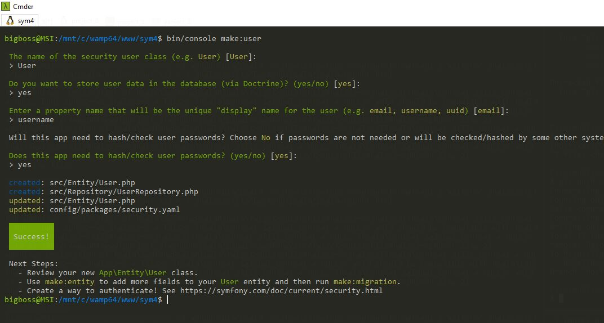
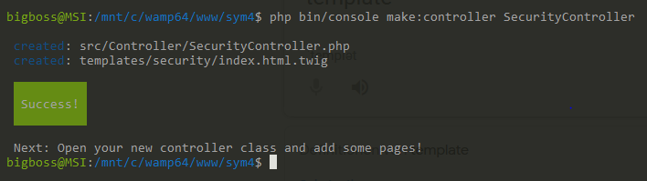
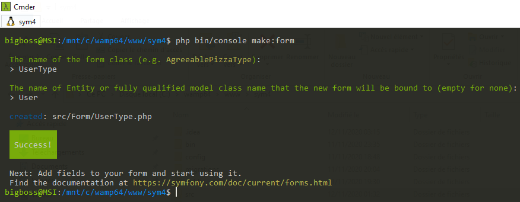
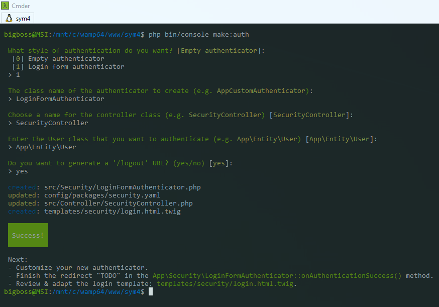
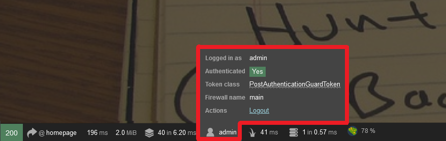
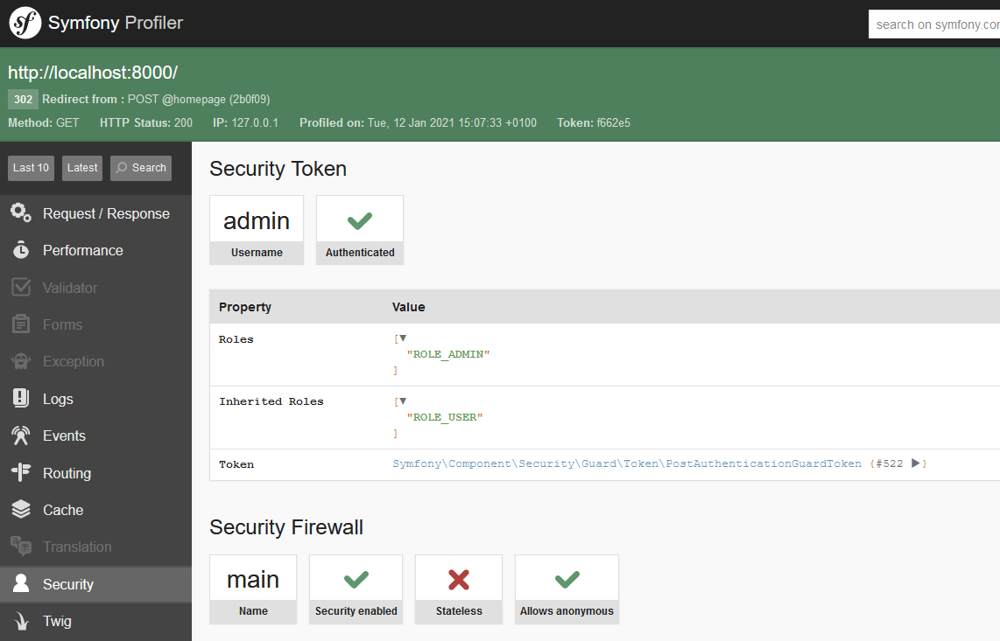

# Guide de l'authentification

Dans ce tutorial, je vais vous montrer comment il est facile d'ajouter un système d'authentification personnalisé à une Application Symfony !

## Avant de commencer

Nous allons travailler avec Symfony 4.4 (Version lts actuelle). Cette version est livrée avec beaucoup d’avantages que nous verrons plus tard dans le tutorial. Une fois que nous aurons ajouté l’authentification à notre application, tous les utilisateurs connectés auront le privilège de gérer les tâches et modifier leur propre compte. Par contre les utilisateurs qui possèdent le rôle administrateur auront l'accès au système de gestion des utilisateurs et le droit de supprimer les tâches anonymes.

Pour mettre en place le système d'authentification nous allons besoin des composants suivants :

- [symfony/maker-bundle](https://symfony.com/doc/current/bundles/SymfonyMakerBundle/index.html): Ce bundle aide à créer des commandes vides, des contrôleurs, des classes de formulaires, des tests, et encore plus....
- [symfony/security-bundle](https://symfony.com/doc/current/security.html): Ce pack intègre le système de sécurité complet de notre application Web Symfony et fournit des moyens d’autoriser les utilisateurs authentifiés en fonction de leurs rôles.

## Commencer

### Création d’une classe _User_

Avant de pouvoir enregistrer ou authentifier un utilisateur au sein de notre application, nous devons créer une classe ou une entité. Pour faciliter la tâche, utiliser le pack ``symfony/maker`` à partir du terminal pour la générer.

```bash
$ php bin/console make:user
```
La commande ci-dessus vous posera plusieurs questions afin que les fichiers appropriés puissent être générés automatiquement pour vous. Suivez l’invite de commande et répondez en conséquence, comme indiqué ici :

[](make-user.png)
[Voir la doc](https://symfony.com/doc/4.4/security.html#a-create-your-user-class)

Cela créera deux nouveaux fichiers nommés ``src/Entity/User.php`` et ``src/Repository/UserRepository.php`` et mettra également à jour le fichier ``config/packages/security.yaml`` Avant de conclure cette section, nous allons faire des petites modifications.

Ouvrez le fichier ``src/Entity/User.php`` et mettez son contenu à jours, comme indiqué ci-dessous :

```php
// src/Entity/User.php

class User implements UserInterface
{
...
    /**
     * @ORM\Column(type="string", length=255, unique=true)
     */
    private string $email = '';
....
    public function getEmail(): string
    {
        return $this->email;
    }

    public function setEmail(string $email): self
    {
        $this->email = $email;

        return $this;
    }
}
```
>En plus des propriétés créées automatiquement par le ``MakerBundle Symfony``, ajoutez une nouvelle propriété ``email`` et créer à la fois ses méthodes getter et setter. Toutes les propriétés définies ici représenteront chaque champ pour la table ``user`` dans la base de données.

```php
// src/Entity/User.php

    public const ROLE_USER = 'ROLE_USER';
    public const ROLE_ADMIN = 'ROLE_ADMIN';

    public const DEFAULT_ROLES = [self::ROLE_USER];
    public const ALL_ROLES = [self::ROLE_ADMIN, self::ROLE_USER];
...
    
    public function __construct()
    {
        $this->roles = self::DEFAULT_ROLES;
    }

    public function getRoles(): array
    {
        return $this->roles;
    }
```
>Afin de simplifier la gestion des rôles, nous allons modifier la méthode ``getRoles()`` et ajouter un constructeur à la classe pour donner une valeur par défaut à cette propriété.

### Mise en place des contrôleurs

#### Contrôleur : _Login_

Ici nous allons générer un nouveau contrôleur qui gérera le processus de connexion pour les utilisateurs enregistrés dans notre base de données.

```bash
$ php bin/console make:controller SecurityController
```
>Après avoir exécuté la commande ci-dessus, Deux fichiers seront créés comme l'image en dessous le montre.

[](make-securityControler.png)
[Voir la doc](https://symfony.com/doc/4.4/controller.html)

Supprimez le fichier ``templates/security/index.twig``, car on va intégrer le formulaire de connexion dans le menu de navigation.

#### Contrôleur des utilisateurs (_UserController_)

Nous allons commencer par créer le fichier ``src/Controller/UserController.php``. 

##### Action : Créer utilisateur  (_createAction_)

Ensuite créer l'action qui s’occupe de l’enregistrement des utilisateurs. Ajouter le contenu suivant :

```php
// src/Controller/UserController.php

namespace App\Controller;

use App\Entity\User;
use App\Form\User\UserType;
use Doctrine\ORM\EntityManagerInterface;
use Symfony\Bundle\FrameworkBundle\Controller\AbstractController;
use Symfony\Component\HttpFoundation\Request;
use Symfony\Component\HttpFoundation\Response;
use Symfony\Component\Routing\Annotation\Route;

/**
 * @Route("/users")
 */
class UserController extends AbstractController
{
    /**
     * @Route("/create", name="user_create")
     * @IsGranted("ROLE_ADMIN")
     */
    public function createAction(Request $request, EntityManagerInterface $entityManager): Response
    {
        $user = new User();

        // Créer un formulaire 
        $form = $this->createForm(UserType::class, $user);

        // lire les données des superglobales PHP correctes (c'est-à-dire $ _POST ou $ _GET) 
        $form->handleRequest($request);
        
        // Vérifier la soumission et la validation du formulaire 
        if ($form->isSubmitted() && $form->isValid()) {
            // Dire à Doctrine (éventuellement) d'enregistrer le produit (pas de requêtes à la base de données)
            $entityManager->persist($user);

            //Exécuter réellement les requêtes (c'est-à-dire la requête INSERT)
            $entityManager->flush();

            $this->addFlash('success', "L'utilisateur a bien été ajouté.");

            return $this->redirectToRoute('user_list');
        }

        return $this->render('user/create.html.twig', [
            'form' => $form->createView(),
        ]);
    }
}
```

##### Action : liste des utilisateurs (_listAction_)

Nous allons créer l'action qui généra la liste des utilisateurs créés, comme indiqué précédemment. 
Ajouter le contenu suivant au fichier ``src/Controller/UserController.php``.

```php
// src/Controller/UserController.php

...

    /**
     * @Route("", name="user_list")
     * @IsGranted("ROLE_ADMIN")
     */
    public function listAction(UserRepository $repository): Response
    {
        $users = $repository->findAll();

        return $this->render('user/list.html.twig', [
            'users' => $users,
        ]);
    }
```
>Ici l'action récupère la liste des utilisateurs à partir de notre base de données à l'aide de la classe ``UserRepository`` que nous avons créée avant, et elle l’a transmis à une vue nommée ``list.html.twig`` dans le répertoire ``user``.

Maintenant que nous avons terminé la création de tous les contrôleurs requis pour l'authentification, nous pouvons maintenant procéder à la création du formulaire d’enregistrement et de connexion. Mais avant cela, vous remarquerez que nos contrôleurs ont deux annotations de PHP :
1. ``@Route("/routename", name="routename")`` Ceci est utilisé par **Symfony** pour définir l’itinéraire qui recevra une demande particulière et rendre une vue où et quand cela est nécessaire. [plus d'info](https://symfony.com/doc/4.4/routing.html).
2. ``@IsGranted("ROLE_ADMIN")`` Ceci est le moyen le plus simple de limiter l'accès des utilisateurs aux routes. [plus d'info](https://symfony.com/doc/current/bundles/SensioFrameworkExtraBundle/annotations/security.html).

### Création des formulaires

#### Formulaire : Création d'un utilisateur _UserType_

Plus tôt, nous avons fait référence à un formulaire dans le fichier ``UserController::createAction()`` exactement la ligne **#27**.

```php
    $form = $this->createForm(UserType::class, $user);
```
Nous allons créer le formulaire dans cette section. Pour commencer, nous utiliserons le bundle ``Maker`` pour créer un formulaire d'enregistrement des utilisateurs. Cela supprime le stress impliqué dans la création et le rendu des champs de formulaires, la validation de manipulation, et ainsi de suite.

Exécutez la commande suivante et suivez les invites pour générer le formulaire d’inscription :

```bash
$ php bin/console make:form
```

Commencez par entrer ``UserType`` comme nom de la classe de formulaire. Ensuite, entrez le nom de la classe liée à notre futur formulaire ``User`` (classe créée précédemment)

[](make-userType.png)
[Voir la doc](https://symfony.com/doc/4.4/forms.html)

Maintenant, déplacez le fichier ``src/Form/UserType.php`` vers ``src/Form/User/UserType.php`` ouvrez-le et remplacez son contenu par :

```php
// src/Form/User/UserType.php

namespace App\Form\User;

use App\Entity\User;
use Symfony\Component\Form\Extension\Core\Type\ChoiceType;
use Symfony\Component\Form\Extension\Core\Type\EmailType;
use Symfony\Component\Form\Extension\Core\Type\PasswordType;
use Symfony\Component\Form\Extension\Core\Type\RepeatedType;
use Symfony\Component\Form\Extension\Core\Type\TextType;
use Symfony\Component\Form\FormBuilderInterface;
use Symfony\Component\OptionsResolver\OptionsResolver;

class UserType extends AbstractType
{
    public function buildForm(FormBuilderInterface $builder, array $options): void
    {
        $builder
            ->add('username', TextType::class, ['empty_data' => ''])
            ->add('email', EmailType::class, ['empty_data' => ''])
            ->add('password', RepeatedType::class, [
                'type' => PasswordType::class,
                'empty_data' => '',
                'invalid_message' => 'Les deux mots de passe doivent correspondre.',
                'first_options' => ['label' => 'Mot de passe'],
                'second_options' => ['label' => 'Tapez le mot de passe à nouveau'],
            ])
            ->add('roles', ChoiceType::class, [
                'choices' => $this->getRolesOptions(),
            ])
        ;
    }
    // Transformer le nom du Role dans le champ select du formulaire (ex: ROLE_ADMIN => Admin) 
    protected function getRolesOptions(): array
    {
        $roles = User::ALL_ROLES;
        $values = [];

        foreach ($roles as $role) {
            $prefix = 'ROLE_';
            $key = strtolower(str_replace($prefix, '', $role));
            $values[ucfirst($key)] = $role;
        }

        return $values;
    }

    public function configureOptions(OptionsResolver $resolver): void
    {
        $resolver->setDefaults([
            'data_class' => User::class,
        ]);
    }
}
```

>Tout d’abord, nous avons modifié le contenu généré pour ce fichier en incluant le type pour chacun des champs de formulaire et également inclus un deuxième champ de mot de passe pour sa confirmation. Ces champs de formulaires seront affichés sur le formulaire d’inscription. À-propos de la méthode ``getRolesOptions()``, son rôle est de générer un **tableau associatif** avec les bonnes valeurs pour le passer après à notre champ select.

#### Formulaire de connexion

Créer un formulaire de connexion puissant pour l'application **Symfony** est assez simple. Le ``Makerbundle`` peut être utilisé pour démarrer facilement une nouvelle forme de connexion sans casse de tête. Selon votre configuration, on peut vous poser différentes questions, et votre code généré peut être légèrement différent. Pour créer le formulaire de connexion, exécutez la commande suivante :

```bash
$ php bin/console make:auth
```
>Vous serez invité à fournir des réponses à quelques questions. Voici un exemple aux réponses que vous pouvez 
rencontrer à la commande précédente : 
 
[](make-auth.png)
[Voir la doc](https://symfony.com/doc/4.4/security/form_login_setup.html)

Une fois le processus terminé, deux nouveaux fichiers seront automatiquement créés pour vous et il mettra également à jour deux autres comme le montre l'image ci-dessus. Et après vous devez :

1. Créez un nouveau répertoire ``src/Security/guard/`` et Déplacez le fichier ``src/Security/LoginFormAuthenticator.php`` dedans.
2. Supprimer le fichier ``templates/security/login.html.twig``.
3. Ouvrez le fichier ``src/Controller/SecurityController.php`` et changez les noms des routes comme indiqué ici:

```php
// src/Controller/SecurityController
...
    /**
     * @Route("/", name="homepage")
     */
    public function homepageAction(AuthenticationUtils $authenticationUtils)
...
    /**
     * @Route("/logout", name="logout")
     */
    public function logout()
...
```
>La **homepage** va jouer le rôle de l'action ``login`` et ``homepage`` dans notre application.
 
Ensuite ouvrez le fichier ``src/Security/guard/LoginFormAuthenticator.php`` et mettez-le à jour comme indiqué ici :

```php
//src/Security/guard/LoginFormAuthenticator.php

namespace App\Security\Guard;

use Symfony\Component\HttpFoundation\RedirectResponse;
use Symfony\Component\HttpFoundation\Request;
use Symfony\Component\Routing\Generator\UrlGeneratorInterface;
use Symfony\Component\Security\Core\Authentication\Token\TokenInterface;
use Symfony\Component\Security\Core\Encoder\UserPasswordEncoderInterface;
use Symfony\Component\Security\Core\Exception\AuthenticationException;
use Symfony\Component\Security\Core\Exception\InvalidCsrfTokenException;
use Symfony\Component\Security\Core\Security;
use Symfony\Component\Security\Core\User\UserInterface;
use Symfony\Component\Security\Core\User\UserProviderInterface;
use Symfony\Component\Security\Csrf\CsrfToken;
use Symfony\Component\Security\Csrf\CsrfTokenManagerInterface;
use Symfony\Component\Security\Guard\Authenticator\AbstractFormLoginAuthenticator;

/**
 * Class LoginFormAuthenticator.
 */
class LoginFormAuthenticator extends AbstractFormLoginAuthenticator
{
    public const LOGIN_ROUTE = 'homepage';

    private UrlGeneratorInterface $urlGenerator;
    private CsrfTokenManagerInterface $csrfTokenManager;
    private UserPasswordEncoderInterface $passwordEncoder;

    /**
     * LoginFormAuthenticator constructor.
     *
     * @param UrlGeneratorInterface        $urlGenerator
     * @param CsrfTokenManagerInterface    $csrfTokenManager
     * @param UserPasswordEncoderInterface $passwordEncoder
     */
    public function __construct(UrlGeneratorInterface $urlGenerator, CsrfTokenManagerInterface $csrfTokenManager, UserPasswordEncoderInterface $passwordEncoder)
    {
        $this->urlGenerator = $urlGenerator;
        $this->csrfTokenManager = $csrfTokenManager;
        $this->passwordEncoder = $passwordEncoder;
    }

    /**
     * {@inheritdoc}
     */
    public function getLoginUrl(): string
    {
        return $this->urlGenerator->generate(self::LOGIN_ROUTE);
    }

    /**
     * {@inheritdoc}
     */
    public function supports(Request $request): bool
    {
        return self::LOGIN_ROUTE === $request->attributes->get('_route')
            && $request->isMethod(Request::METHOD_POST);
    }

    /**
     * {@inheritdoc}
     *
     * @return string[] $credentials
     */
    public function getCredentials(Request $request): array
    {
        $parametersBag = $request->request;
        $credentials = [
            'username' => $parametersBag->get('_username'),
            'password' => $parametersBag->get('_password'),
            'csrf_token' => $parametersBag->get('_csrf_token'),
        ];

        $request->getSession()->set(
            Security::LAST_USERNAME,
            $credentials['username']
        );

        return $credentials;
    }

    /**
     * {@inheritdoc}
     *
     * @param string[] $credentials
     *
     * @throws InvalidCsrfTokenException|AuthenticationException
     */
    public function getUser($credentials, UserProviderInterface $userProvider): ?UserInterface
    {
        $token = new CsrfToken('authenticate', $credentials['csrf_token']);
        if (!$this->csrfTokenManager->isTokenValid($token)) {
            // Fail authentication with an error
            throw new InvalidCsrfTokenException();
        }

        /** @var UserInterface|null $user */
        $user = $userProvider->loadUserByUsername($credentials['username']);

        if (!$user) {
            // Fail authentication with a custom error
            throw new AuthenticationException();
        }

        return $user;
    }

    /**
     * {@inheritdoc}
     *
     * @param string[] $credentials
     *
     * @throws AuthenticationException
     */
    public function checkCredentials($credentials, UserInterface $user): bool
    {
        if ($this->passwordEncoder->isPasswordValid($user, $credentials['password'])) {
            return true;
        }

        // Fail authentication with an UsernameNotFoundError if password doesn't match
        throw new AuthenticationException();
    }

    /**
     * {@inheritdoc}
     *
     * @param string $providerKey
     *
     * @return RedirectResponse | null
     */
    public function onAuthenticationSuccess(Request $request, TokenInterface $token, $providerKey): ?RedirectResponse
    {
        return new RedirectResponse($this->urlGenerator->generate('homepage'));
    }
}
```

### Mise en place de l’authentification

**Symfony** est expédié avec un composant de sécurité impressionnant appelé ``Guard`` qui simplifie le processus d’authentification. Profitons-en dans notre application. La première étape consiste à configurer les paramètres de sécurité Symfony.

Ouvrez le fichier ``config/packages/security.yaml`` et configurez-le comme ici :

```yaml
security:
    encoders:
        App\Entity\User:
            algorithm: auto
    providers:
        users_in_database:
            entity:
                class: App\Entity\User
                property: username
    firewalls:
        dev:
            pattern: ^/(_(profiler|wdt)|css|images|js)/
            security: false
        main:
            anonymous: lazy
            provider: users_in_database
            form_login:
                login_path: homepage
                check_path: homepage
            logout:
                path: logout
                target: homepage
            guard:
                authenticators:
                    - App\Security\Guard\LoginFormAuthenticator
    role_hierarchy:
      ROLE_ADMIN: ROLE_USER
    access_control:
      - { path: ^/users/\d+/edit, roles: ROLE_USER }
      - { path: ^/users/\d+/edit-password, roles: ROLE_USER }
      - { path: ^/users, roles: ROLE_ADMIN }
      - { path: ^/tasks, roles: ROLE_USER }
      - { path: ^/,      roles: IS_AUTHENTICATED_ANONYMOUSLY }
```

Grace au ``MakerBundle`` La plupart des sections du fichier précédent ont été préconfigurées automatiquement. Il gère ce qui suit comme indiqué par les 3 premières sections :

- **encoders** : Ceci est utilisé pour configurer la façon dont les mots de passe créés dans l’application seront hachages et depuis quelle entité (ici User). Laisser la valeur en ``auto`` pour ``algorithm`` ce qui sélectionnera automatiquement le meilleur algorithme de hachage possible.
- **providers** : Cela indique la classe PHP qui sera utilisé pour charger un objet utilisateur depuis la session.
- **firewalls** : Ceci est utilisé pour définir comment les utilisateurs de notre application seront authentifiés.
    - **provider** : Comme value en lui donne le nom du provider qu'on a choisit pour l'authentification ``users_in_database``.
    - **form_login** : On indique au système comment diriger l'utilisateur vers le formulaire de connexion lorsque le système de sécurité lance le processus d'authentification. comme valeur on utilise le nom de la route situé dans le ``SecurityController.php``
    - **logout** : Pour rediriger un utilisateur vers la page de **connexion** après un processus de déconnexion 
    réussi, nous avons modifié la section ``logout`` en changeant le chemin cible ``target`` pour login.
    - **guard** : Cela indique la classe PHP qui gère la surveillance du système d'authetification.
- **role_hierarchy** : Au lieu de donner de nombreux rôles à chaque utilisateur, vous pouvez définir des règles 
    d'héritage de rôle en créant une hiérarchie de rôles. Les utilisateurs avec le rôle ``ROLE_ADMIN`` auront également le rôle ``ROLE_USER``.
- **access_control** : en se basant sur le rôle d'utilisateur, nous allons définir les limitations d'accès à certaines pages du site.
>Avant d'aller plus loin j'aimerais vous expliquez une chose, **Symfony** considère les visiteurs non connectés de votre application, comme des utilisateurs authentifiés avec le rôle ``annonymous``. C'est d'ici d'où vient le rôle ``IS_AUTHENTICATED_ANONYMOUSLY``. Si je ne me trompe pas vous avez déjà remarqué, que nous avons laissé l'accès ouvert à tous nos visiteurs. (Dernière ligne du ficher ``security.yaml``)

Pour plus d'info [visitez la doc](https://symfony.com/doc/4.4/reference/configuration/security.html)

### Mise en place des vues

#### Vue : Liste des utilisateurs

Le Framework **Symfony** est livré avec un puissant moteur templates appelé Twig. Twig vous permet d’écrire des templates concis et lisibles qui sont plus amicaux pour les concepteurs web et de plusieurs façons, plus puissants que les templates PHP.

La mise en page de base de notre application a été configurée dans le fichier ``templates/base.html.twig``. Toutes les vues utilisent le framework Bootstrap CSS, mais ce n'est pas une obligation nous somme libre de les personnaliser comme nous souhaitons.

>Pour savoir comment créer et utiliser les templates dans un projet **Symfony** 
[visitez ce lien](https://symfony.com/doc/4.4/templates.html).

Créer le fichier suivant ``templates/user/list.html.twig``

```twig
{# templates/user/list.html.twig #}
{# extends 'base.html.twig' #}


    <div class="container">
        <div class="row">
            <div class="col-12 mb-5">
                <a class="btn btn-shadow btn-primary float-right" href="{{ path('user_create')}}">Créer un utilisateur</a>
            </div>
            <div class="col-12 table-responsive">
                <table class="table table-striped">
                    <thead class="font-weight-bolder">
                    <tr class="text-center">
                        <th scope="col">#</th>
                        <th scope="col">Nom d'utilisateur</th>
                        <th scope="col">Adresse d'utilisateur</th>
                        <th scope="col">Actions</th>
                    </tr>
                    </thead>
                    <tbody>
                    
                        <tr class="text-center">
                            <th scope="row" class="font-weight-bolder">{{ loop.index }}</th>
                            <td>{{ user.username }}</td>
                            <td>{{ user.email }}</td>
                            <td>
                                
                                <a id="user-{{ userId }}" href="{{ path('user_edit', {'id' : userId}) }}" class="btn btn-success btn-sm">
                                    <span class="btn-shadow d-none d-lg-block">Éditer</span>
                                    <span class=" glyphicon glyphicon-pencil text-white d-lg-none"></span>
                                </a>
                            </td>
                        </tr>
                    
                    </tbody>
                </table>
            </div>
        </div>
    </div>

```

>Ici, nous parcourons les données du tableau associatif ``users`` transmis par l'action ``UserController::listAction()`` à la vue``template/user/list.html.twig``.

#### Vue : Connexion

Ouvrez le fichier ``temaplates/partials/_header_default.html.twig`` et ajoutez le formulaire de connexion:

```twig
{# templates/partials/_navbar.html.twig #}

<nav class="navbar navbar-light fixed-top navbar-expand-lg" >
    <div class="container">
        
            <ul class="navbar-nav mr-auto h4 float-right">
                <li class="nav-item">
                    <a class="btn-bg-danger" href="{{ path('logout') }}">Se déconnecter</a>
                </li>
            </ul>
            
                <ul class="navbar-nav mr-auto h4 float-left">
                    <li class="nav-item">
                        <a class="nav-link nav-deco" href="{{ path('user_list') }}">Utilisateurs</a>
                    </li>
                </ul>
            
        
            <ul class="navbar-nav float-lg-right mr-5">
                <li class="nav-item">
                    <form action="{{ path('homepage') }}" method="post">
                        <div class="form-row">
                            <div class="col-lg-4 col-sm-12 mt-lg-0 mt-5">
                                <label for="username" class="d-none">Username</label>
                                <input class="form-control" placeholder="Username" type="text" id="username" name="_username" value="{{ last_username }}"/>
                            </div>
                            <div class="col-lg-4 col-sm-12 mt-lg-0 mt-1">
                                <label for="password" class="d-none">Username</label>
                                <input class="form-control" placeholder="Mot de passe" type="password" id="password" name="_password" />
                                <input type="hidden" name="_csrf_token" value="{{ csrf_token('authenticate') }}">
                            </div>
                            <div class="col-lg-4 col-sm-12 mt-lg-0 mt-3 mb-lg-0 mb-5">
                                <button class="form-control btn btn-success" type="submit">Se connecter</button>
                            </div>
                        </div>
                    </form>
                </li>
            </ul>
        
    </div>
</nav>
```

>Dans notre ``_navbar`` template, nous avons utilisé la fonction **helper build-in ``is_granted()``** pour vérifier
 si l'utilisateur actuel a un certain rôle. La fonction retourne ``true`` si c'est vrai, sinon il retourne ``null``.

>``is_granted('IS_AUTHENTICATED_FULLY')`` ici nous allons afficher le bouton de déconnexion si un utilisateur est connecté, sinon nous allons se contenter d'afficher le formulaire de connexion.

>``is_granted('ROLE_ADMIN')`` quand un utilisateur avec le rôle **admin** est connecté, nous allons afficher le lien 
``liste des utilisateurs``.

#### Vue : Créer un utilisateur

Créez le fichier ``template/user/create.html.twig`` et ajoutez le code suivant:

```twig
{# extends 'base.html.twig' #}


    <div class="container">
        <div class="row">
            <div class="col-12">
                {{ form_start(form, {'action' : path('user_create')}) }}
                <div class="form-row">
                    <div class="col-12">
                        {{ form_row(form.username) }}
                    </div>
                    <div class="col-12">
                        {{ form_row(form.email) }}
                    </div>
                    <div class="col-12">
                        {{ form_row(form.password) }}
                    </div>
                    <div class="col-12">
                        {{ form_row(form.roles) }}
                    </div>
                    <div class="col-6">
                        <a href="{{ path('user_list') }}" class="float-left btn btn-primary">Retour à la liste des utilisateurs</a>
                    </div>
                    <div class="col-6">
                        <button type="submit" class="btn-shadow float-right btn btn-success pull-right">Ajouter</button>
                    </div>
                </div>
                {{ form_end(form) }}
            </div>
        </div>
    </div>

```
>Ici, nous avons simplement intégré notre formulaire ``Form/UserType.php`` dans cette template, à l'aide des méthodes de [Symfony built-in form](https://symfony.com/doc/4.4/forms.html) 
   
### La barre d’outils de débogage de profil

L’un des éléments les plus reconnaissables et impressionnantes des applications Symfony, c'est sa la barre d’outils de débogage web. Pas seulement elle donne des informations sur l'utilisateur et un liens le déconnecter, mais aussi elle fournit toutes sortes d’informations sur les sessions, les cookies, les variables, le temps de chargement, les fournisseurs de services, le cycle de temps de réponse à la demande, la taille de l’application, un journal d’erreurs étendu. Cette barre d’outils augmente la productivité des développeurs Symfony car elle rend le débogage super facile!

[](profile-debug-Toolbar.png)

[](profiler-connected.png)
[Documentation du composant Profiler](https://symfony.com/doc/4.4/profiler.html).